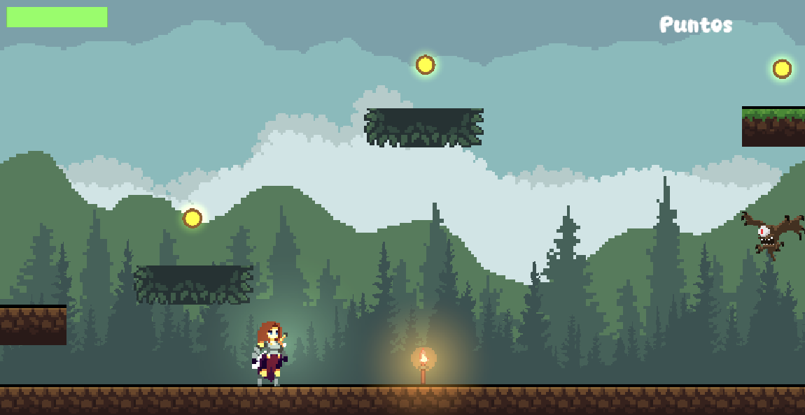

# Plataformas

Este proyecto es un prototipo de juego de plataformas 2d.

Enlace itch.io https://oqubo.itch.io/plataformas2d

Enlace GitHub  https://github.com/oqubo/Plataformas

## Objetivo del juego
El jugador debe  desplazarse por el escenario, recolectar monedas y enfrentarse a enemigos.

## Controles

- Movimiento: AD o flechas
- Salto: Espacio
- Ataque: Ctrl izquierdo o Ratón botón izquierdo
- Menú de pausa: Escape

## Funcionalidades implementadas

- Escenario: Tilemap con tiles personalizados.
- Cámara: Uso de Cinemachine para un seguimiento suave del jugador.
- Jugador: Animaciones completas (caminar, atacar, recibir daño, morir), sonidos y partículas para mejorar el feeling.
- Enemigos: Comportamientos diversos (patrulla, detección, persecución y ataque), animaciones y feedback visual al recibir daño.
- Menú de pausa funcional (continuar, reiniciar, salir).
- Monedas coleccionables que suman puntos.
- Ciclo día-noche dinámico.
- Bicho de luz que sigue al jugador.
- Plataformas móviles configurables.
- Programación orientada a objetos:
    - Herencia entre enemigos.
    - Interfaz común para acciones de ataque/daño (IAtaque).
    - Encapsulamiento con propiedades que actualizan la UI.
    - Uso de Singletons para gestión de juego, interfaz y audio.
